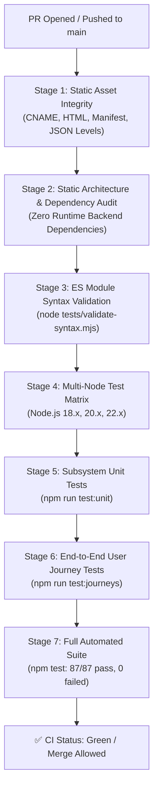

# Casual Maze Game — Comprehensive Testing Plan & QA Strategy

This document defines the automated testing architecture, quality assurance protocols, subsystem coverage matrices, end-to-end user journey specifications, and GitHub Actions CI gating standards for the **Casual Maze Game** engine.

---

## 1. Core Testing Principles

1. **Zero Production Runtime Dependencies**:
   - The test harness is written in pure Modern JavaScript (ES6+ native browser modules with Node.js compatibility).
   - Polyfills and shims (`localStorage`, `sessionStorage`, `Blob`, `FileReader`, `MockCanvas`) are implemented in `tests/harness/mocks.mjs` without adding heavy dependencies like jsdom or puppeteer to production.

2. **Sub-100ms Fast Feedback**:
   - The entire suite (unit tests + multi-step user journeys) executes in $<100\text{ ms}$, ensuring friction-free local execution before every Git commit.

3. **Deterministic & PRNG-Controlled**:
   - All tests utilize fixed PRNG seeds where procedural logic is involved, guaranteeing 100% reproducible test outcomes with zero flakiness.

4. **Layered Test Pyramid**:
   - **Static & Syntax Validation**: Validates file presence, static web constraints, and ES-module syntax across all files.
   - **Subsystem Unit Tests**: Isolated functional verification of Core, Engine, Entities, Levels, and Editor subsystems.
   - **Integration / User Journey Tests**: Multi-step realistic player and architect workflows simulating complete gameplay sessions.
   - **CI Pipeline Gating**: Automated multi-Node matrix execution on every PR targeting `main`.

---

## 2. Test Suite Architecture & Directory Layout

```text
tests/
├── harness/                      # Zero-dependency test framework & mocks
│   ├── assertions.mjs            # Rich assertion helpers with formatted diffs
│   ├── mocks.mjs                 # Browser DOM, Storage, Blob, Canvas polyfills
│   ├── runner.mjs                # TestRunner (describe, it, hooks, timings, CLI filters)
│   └── index.mjs                 # Unified harness exports
├── unit/                         # Subsystem unit test suites
│   ├── core/
│   │   ├── prng.test.mjs         # Seed determinism, float & int distributions, array shuffle
│   │   ├── events.test.mjs       # EventBus subscription, dispatch, once(), unsubscription
│   │   ├── storage.test.mjs      # Project CRUD, editor drafts with timestamps, tutorial progress
│   │   └── constants.test.mjs    # Tile codes, elevation layers, theme tokens, zone metadata
│   ├── engine/
│   │   ├── collision.test.mjs    # Wall hits, floor moves, gates, bridges, ramps, void safety
│   │   ├── fog.test.mjs          # FoV visibility states, Bresenham LoS, wall shadow casting
│   │   ├── camera.test.mjs       # Viewport bounds, snapTo, world-to-screen math, lerp follow
│   │   └── debug-logger.test.mjs # Telemetry events, key/door logs, JSON schema v1.0.0
│   ├── entities/
│   │   ├── player.test.mjs       # Coordinates, elevation, facing, move steps, inventory reset
│   │   └── entities.test.mjs     # Key properties, Door open states, Lever layer mutations
│   ├── levels/
│   │   ├── level-loader.test.mjs # Schema normalization, defaults padding, custom test spawns
│   │   ├── json-integrity.test.mjs # Validates 10 campaign levels, 6 tutorials & manifest.json
│   │   ├── campaign-levels.test.mjs# BFS exit reachability for all 10 campaign levels
│   │   └── tutorial-levels.test.mjs# Solvability for all 6 tutorial levels & key dependencies
│   └── editor/
│       ├── level-validator.test.mjs# Spawn in wall, blocked exit, missing key, deadlock detection
│       └── json-exporter.test.mjs  # Text import/export, clipboard copy, file upload mock
├── integration/
│   └── journeys/                 # Realistic end-to-end player & creator scenarios
│       ├── tutorial-progression.journey.test.mjs # 6-level sequential Tutorial Academy
│       ├── campaign-solvability.journey.test.mjs # Multi-zone campaign & telemetry logging
│       ├── editor-authoring.journey.test.mjs     # Canvas authoring, deadlock fixing & export
│       ├── fog-exploration.journey.test.mjs      # LoS raycasting & shadow occlusions
│       └── multi-elevation.journey.test.mjs      # 3D bridges, ramps, railings & high keys
├── validate-syntax.mjs           # Fast JS/MJS syntax validator
├── validate-static.mjs           # Static assets & zero production dependencies checker
└── run-all.mjs                   # Master test aggregator
```

---

## 3. Subsystem Coverage Matrix

| Subsystem | Test Suite | Focus Areas | Gating Criteria |
| :--- | :--- | :--- | :--- |
| **Core > PRNG** | `tests/unit/core/prng.test.mjs` | Linear congruential generator, uniform distribution, shuffle integrity | $100\%$ seed determinism |
| **Core > EventBus** | `tests/unit/core/events.test.mjs` | Publish/subscribe, multi-listeners, single execution `once()`, `off()` | No memory leaks |
| **Core > Storage** | `tests/unit/core/storage.test.mjs` | Multi-project CRUD, editor autosave timestamps, tutorial best times | Strict schema persistence |
| **Core > Constants** | `tests/unit/core/constants.test.mjs` | Tile enums, elevation layers, direction vectors, theme tokens (6 themes), zone metadata | Complete registry tokens |
| **Engine > Collision** | `tests/unit/engine/collision.test.mjs` | Solid walls, floors, doors, bridges (`B_EW`, `B_NS`), directional ramps (`R_*`), side blocks, voids | Exact collision reasons |
| **Engine > Fog** | `tests/unit/engine/fog.test.mjs` | `UNEXPLORED`, `EXPLORED`, `VISIBLE`, Bresenham raycasting, shadow casting, `mapRevealed` | Accurate visibility mask |
| **Engine > Camera** | `tests/unit/engine/camera.test.mjs` | Viewport culling bounds, `snapTo`, world $\leftrightarrow$ screen conversion, smooth lerp | Boundary clamp safety |
| **Engine > Telemetry** | `tests/unit/engine/debug-logger.test.mjs` | Step timestamps, key/door events, victory summaries, JSON replay format | Schema `1.0.0` compliance |
| **Entities > Player** | `tests/unit/entities/player.test.mjs` | Position, elevation, facing direction, step interpolation, inventory resets | Clean state resets |
| **Entities > Objects** | `tests/unit/entities/entities.test.mjs` | `Key` attributes, `Door` lock states, `Lever` ground/overhead layer tile toggling | Correct tile mutation |
| **Levels > Loader** | `tests/unit/levels/level-loader.test.mjs` | Default normalization, dimension padding, `testSpawn`, `testInventory` | Fallback resilience |
| **Levels > Solvability** | `tests/unit/levels/campaign-levels.test.mjs`<br>`tests/unit/levels/tutorial-levels.test.mjs` | Breadth-First Search (BFS) reachability of exit for all 16 levels | $0$ unsolvable levels |
| **Editor > Validator** | `tests/unit/editor/level-validator.test.mjs` | Spawn in wall, unreachable exit, missing keys, deadlocks, bypass warnings | $100\%$ detection rate |
| **Editor > Exporter** | `tests/unit/editor/json-exporter.test.mjs` | JSON import/export, clipboard copy, file reader upload | Format roundtrip parity |

---

## 4. End-to-End User Journey Specifications

User journey tests simulate realistic multi-step player and creator workflows:

### Journey 1: Novice Player Tutorial Academy
- **File**: `tests/integration/journeys/tutorial-progression.journey.test.mjs`
- **Workflow**:
  1. Complete Tutorial 1 (First Steps: navigation to exit portal).
  2. Complete Tutorial 2 (Keys & Colored Gates: Ruby and Sapphire key dependencies).
  3. Complete Tutorial 3 (Mechanisms & Levers: wall toggling).
  4. Complete Tutorial 4 (Bridges & Elevation: ramp climbing, bridge crossing, descending).
  5. Complete Tutorial 5 (The Shrouded Path: fog of war FoV).
  6. Complete Tutorial 6 (Master's Trial: combined mechanics).
  7. Validate that tutorial progress and best times are saved in `StorageManager`.

### Journey 2: Campaign Explorer & Telemetry Replay
- **File**: `tests/integration/journeys/campaign-solvability.journey.test.mjs`
- **Workflow**:
  1. Play through Campaign Level 1 (The Training Hall).
  2. Pick up Gold Key, unlock door, reach exit.
  3. Verify `DebugLogger` records a 4-event stream (`game:start`, `entity:key_collected`, `entity:door_unlocked`, `game:victory`).
  4. Validate BFS solvability for all 10 Campaign levels across Dungeon, Jungle, and Lava zones.

### Journey 3: Dungeon Architect Authoring & Validation
- **File**: `tests/integration/journeys/editor-authoring.journey.test.mjs`
- **Workflow**:
  1. Initialize empty maze canvas.
  2. Detect walled-off exit warning.
  3. Place locked Ruby Gate without a key $\rightarrow$ detect missing key error.
  4. Place Ruby Key behind the gate $\rightarrow$ detect key-behind-door deadlock.
  5. Move key to accessible starting room $\rightarrow$ level validated as solvable.
  6. Add secret lever mechanism.
  7. Save draft to storage, export to JSON, and verify clean reload.

### Journey 4: Fog Exploration & Dynamic Sightlines
- **File**: `tests/integration/journeys/fog-exploration.journey.test.mjs`
- **Workflow**:
  1. Spawn in dark dungeon with central pillar and solid corners.
  2. Raycast line of sight and verify unvisited rooms remain `UNEXPLORED`.
  3. Navigate around pillar, asserting dynamic visibility changes and memory retention (`EXPLORED`).

### Journey 5: Multi-Elevation 3D Bridge Navigation
- **File**: `tests/integration/journeys/multi-elevation.journey.test.mjs`
- **Workflow**:
  1. Walk under East-West bridge on Ground level.
  2. Approach directional ramp and climb to Elevation 1 (Overhead).
  3. Walk along elevated bridge deck and retrieve high key relic.
  4. Attempt illegal side exits (assert railing blocks jumping into air/void).
  5. Descend via opposite ramp to Ground level.
  6. Unlock ground-level gate with elevated key.

---

## 5. Guidelines for Testing Future Activities

When implementing new gameplay features or mechanics, follow this standard pattern:

### A. Sound & Audio FX
```javascript
// tests/unit/core/audio.test.mjs
describe('Core > AudioManager', () => {
  it('triggers synthesized web audio tone on key collection without blocking game loop', () => {
    // Assert mute settings, tone frequency mapping, and audio unlock state
  });
});
```

### B. Mobile Touch & Virtual Joystick Gestures
```javascript
// tests/unit/engine/touch-controls.test.mjs
describe('Engine > TouchControls', () => {
  it('translates swipe and virtual joystick drag to discrete directional moves', () => {
    // Assert directional vector thresholds and touch cancel resets
  });
});
```

### C. Traps & Hazards (Spikes, Moving Patrollers, Timed Gates)
```javascript
// tests/unit/entities/hazards.test.mjs
describe('Entities > Hazards', () => {
  it('resets player to spawn upon contact with active spike trap', () => {
    // Assert hazard state cycles and collision triggers
  });
});
```

### D. Portals & Teleporters
```javascript
// tests/unit/entities/portals.test.mjs
describe('Entities > Portals', () => {
  it('teleports player from Portal Alpha to Portal Beta preserving elevation', () => {
    // Assert target coordinate mapping and cooldown to prevent infinite loop
  });
});
```

---

## 6. GitHub Actions CI Gating & Automation

Every Pull Request targeting `main` and push to `main` executes a multi-stage automated validation pipeline:



### CI Quality Gates
1. **Static Files Check**: `CNAME`, `index.html`, `maze.html`, `editor.html`, and all 16 JSON level files must exist.
2. **Zero Dependencies Check**: `package.json` must contain zero production `dependencies` to maintain static GitHub Pages compatibility.
3. **Syntax Check**: All JS and MJS modules must parse cleanly without syntax errors.
4. **Unit & Journey Suites**: 100% test pass rate (`0 failed`).
5. **Multi-Node Support**: Pipeline must pass cleanly across Node 18.x, 20.x, and 22.x.

---

## 7. Command Reference

| Command | Purpose |
| :--- | :--- |
| `npm test` | Run complete automated test suite (21 suites, 87 tests) |
| `npm run test:unit` | Run all subsystem unit tests |
| `npm run test:journeys` | Run all 5 end-to-end user journey tests |
| `npm run validate:syntax` | Validate JavaScript syntax across all source and test files |
| `npm run validate:static` | Validate static file presence and zero production dependencies |
| `node tests/run-all.mjs --suite=<name>` | Run test suites matching `<name>` filter (e.g. `--suite=collision`) |
| `node tests/run-all.mjs --grep=<pattern>` | Run specific test cases matching regex pattern (e.g. `--grep=deadlock`) |
| `node tests/run-all.mjs --verbose` | Run test runner in verbose mode with detailed step logs |
